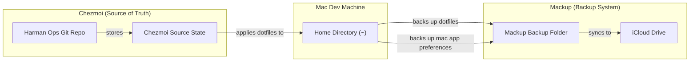

# harmon-ops

Various scripts, dotfiles, automation, and IaC for my developer environment and homelab infrastructure with self-hosted apps, Raspberry Pis, Dockerfiles, etc.

E.g., it helps me bootstrap new computers with a developer environment customized to my liking with shell scripts, dotfiles, package managers, OS settings, IDE preferences, extensions, git customizations, shell aliases, cli packages, programming languages, Dockerfiles, etc. so that my machine is fully setup in a day instead of continually encountering all the numerous customizations that I have gotten used to and then have to gradually fix over weeks.

It also helps me keep track of and document my evolving homelab setup and architecture with documentation, diagrams, and Infrastructure as Code (IaC). I keep track of config and packages for each machine in `infra/`. All scripts should be idempotent.

## Project Usage

### Setup

```bash
brew install go-task/tap/go-task
brew install pre-commit  # or: pip install pre-commit
```

### [Taskfile Task Runner (Taskfile.yml)](https://taskfile.dev/)

```bash
task validate
task security
task snyk
```

## dotfiles

Uses Mackup for backing up both shell dotfiles and Mac app preferences to iCloud, as well as Chezmoi as a declarative source of truth for my shell dotfiles



## OS config for bootstrapping new machines with a developer environment - `os/`

### Setup a Mac

1. Follow `os/mac/CHECKLIST-MAC.md`
2. Run `os/mac/setupMac.sh`

### Setup a Linux machine (Not well-developed)

1. Follow `os/linux/CHECKLIST-LINUX.md`
2. Run `os/linux/setupLinux.sh`

### Setup a Windows machine

1. Follow `os/win/CHECKLIST-WIN.md`
2. Run `os/win/setupWindows.ps1`

### Shell Environments

On a Mac, bash, zsh, and fish dotfiles are backed up and restored with mackup command in `setupMac.sh` and `updateMac.sh`. My other global custom dotfiles like `shell_vars` and `shell_aliases` are stored in `~/.dotfiles` and configured to be backed up and restored with `mackup backup|restore`.

### Python

This is automatically run from setupMac.sh
`os/languages/python/setupPython.sh`

### JavaScript

This is automatically run from setupMac.sh
`os/languages/javaScript/setupJavaScript.sh`

### Java

`os/languages/java/setupJava.sh` (currently commented out in setupMac.sh)

### Docker

- `docker-compose.yml` with various useful docker images
- A docker environment setup for Windows that makes developing on Windows easier due to bash, linux, containers, etc.

## Homelab and Infrastructure - `infra/`

Packages, Brewfiles, IaC, diagrams, etc.

[My Network and Services Diagram in yEdLive](https://www.yworks.com/yed-live/?file=https://gist.githubusercontent.com/evanharmon1/a57b085867f207b44c2c5d2d721e4433/raw/10f133fb285fcf5296d3e8b4edc821707e2e203b/harmon-ops-network-and-services-2)

[My Data and Backups Diagram in yEdLive](https://www.yworks.com/yed-live/?file=https://gist.githubusercontent.com/evanharmon1/cd03a2f4d93bb36876ff512eb3254905/raw/37c961a7100c48e2dc0a581859903ae290d2ce43/Harmon%20Data.graphml%202.graphml.graphml%202.graphml%202)


- A docker environment setup for Windows that makes developing on Windows easier due to bash, linux, containers, etc.

## Heplful Sources

- [Homebrew](https://brew.sh/)
- [mas](https://github.com/mas-cli/mas)
- [mackup](https://github.com/lra/mackup)
- <https://gist.github.com/MatthewMueller/e22d9840f9ea2fee4716>

## My Current Developer Environment

- Terminal
  - Ghostty
  - iTerm2 (alternate)
- Shell
  - Oh-my-zsh
  - Bash (alternate)
- Package Management
  - Homebrew
- IDE
  - VS Code
  - VS Code Insiders (alternate)
- Dotfiles
  - Mackup
  - Chezmoi
- Version management
  - mise
  - uv (Python)
- AI
  - Claude Code
  - Codex (alternate)
  - OpenCode (altercate)
- Git
  - Git
  - GitHUb
  - GitHub Actions
  - Copier
  - gh cli
- Task Runner
  - go-task (Taskfile.yml)
