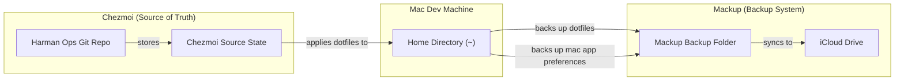

# harmon-ops

Various scripts, dotfiles, and automation for my developer environment and homelab infrastructure.

E.g., it helps me bootstrap new computers with a developer environment customized to my liking with shell scripts, dotfiles, package managers, OS settings, IDE preferences, extensions, git customizations, shell aliases, cli packages, programming languages, Dockerfiles, etc. so that my machine is fully setup in a day instead of continually encountering all the numerous customizations that I have gotten used to and then have to gradually fix over weeks.

## Project Usage

### Requirements

- Homebrew
- Python
- [Taskfile](https://taskfile.dev/)

### Bootstrap

Install required software to run other project installers and task runners

`task bootstrap`

### Install

Install required dependencies

`task install`

### Task Runner

[Taskfile.yaml](./Taskfile.yml)

### Testing

#### Validate

`task validate`

#### Security

`task security`

#### Linting, Formatting, Conventions, Style Guidelines, etc

- .pre-commit-config.yaml
- .shellcheckrc
- .ansible-lint-ignore

## Todo File

[todo.md](./todo.md)

## dotfiles

Uses Mackup for backing up both shell dotfiles and Mac app preferences to iCloud, as well as Chezmoi as a declarative source of truth for my shell dotfiles

## OS config for bootstrapping new machines with a developer environment - `os/`

### Setup a Mac

1. Follow `os/mac/CHECKLIST-MAC.md`
2. Run `os/mac/setupMac.sh`

### Setup a Linux machine (Not well-developed)

1. Follow `os/linux/CHECKLIST-LINUX.md`
2. Run `os/linux/setupLinux.sh`

### Setup a Windows machine

1. Follow `os/win/CHECKLIST-WIN.md`
2. Run `os/win/setupWindows.ps1`

### Shell Environments

On a Mac, zsh and dotfiles are backed up and restored with mackup command in `setupMac.sh` and `updateMac.sh`. My other global custom dotfiles like `shell_vars` and `shell_aliases` are stored in `~/.dotfiles` and configured to be backed up and restored with `mackup backup|restore`.

### Python

This is automatically run from setupMac.sh
`os/languages/python/setupPython.sh`

### JavaScript

This is automatically run from setupMac.sh
`os/languages/javaScript/setupJavaScript.sh`

### Java

`os/languages/java/setupJava.sh` (currently commented out in setupMac.sh)

## Machines

Each machine that I configure is tracked in `machines/` where I can track packages, Brewfiles, etc.

## Heplful Sources

- [Homebrew](https://brew.sh/)
- [mas](https://github.com/mas-cli/mas)
- [mackup](https://github.com/lra/mackup)
- <https://gist.github.com/MatthewMueller/e22d9840f9ea2fee4716>

## My Current Developer Environment

- Terminal
  - Ghostty
  - iTerm2 (alternate)
- Shell
  - Oh-my-zsh
  - Bash (alternate)
- Package Management
  - Homebrew
- IDE
  - VS Code
  - VS Code Insiders (alternate)
- Dotfiles
  - Mackup
  - Chezmoi
- Version management
  - mise
  - uv (Python)
- AI
  - Claude Code
  - Codex (alternate)
  - OpenCode (altercate)
- Git
  - Git
  - GitHUb
  - GitHub Actions
  - Copier
  - gh cli
- Task Runner
  - go-task (Taskfile.yml)
