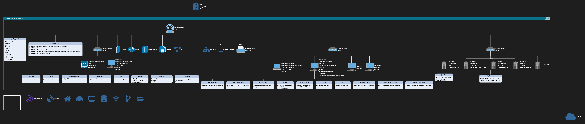
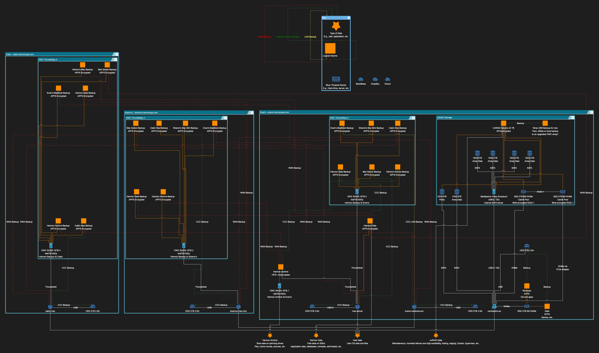

# harmon-ops
Various scripts, dotfiles, automation, and IaC for my developer environment and homelab infrastructure with self-hosted apps, Raspberry Pis, Dockerfiles, etc.

E.g., it helps me bootstrap new computers with a developer environment customized to my liking with shell scripts, dotfiles, package managers, OS settings, IDE preferences, extensions, git customizations, shell aliases, cli packages, programming languages, Dockerfiles, etc. so that my machine is fully setup in a day instead of continually encountering all the numerous customizations that I have gotten used to and then have to gradually fix over weeks.

It also helps me keep track of and document my evolving homelab setup and architecture with documentation, diagrams, and Infrastructure as Code (IaC). I keep track of config and packages for each machine in `infra/`. All scripts should be idempotent.

## Project Usage
### Setup
`brew install go-task/tap/go-task`
`brew install pre-commit` or `pip install pre-commit`
### Taskfile Task Runner (Taskfile.yml)
https://taskfile.dev/
`task validate`
`task security`
`task snyk`

### Start new dev project
From `~/dev`: `newProject.sh -n nameOfProject -g gitRepoName`

## OS config for bootstrapping new machines with a developer environment - `osConfig/`
### Setup a Mac
1. Follow `osConfig/mac/CHECKLIST-MAC.md`
2. Run `osConfig/mac/setupMac.sh`

### Setup a *nix machine (Not well-developed)
1. Follow `osConfig/nix/CHECKLIST-NIX.md`
2. Run `osConfig/nix/setupNix.sh`

### Setup a Windows machine (Not well-developed)
**Might Need to clone to a fresh `windows` branch from master for windows machines due to file path incompatibilities in the mac folder. You would need to delete the mac folder on that branch to avoid the errors.**
1. Follow `osConfig/win/CHECKLIST-WIN.md`
2. Run `osConfig/win/setupWindows.ps1`

### Shell Environments
On a Mac, bash, zsh, and fish dotfiles are backed up and restored with mackup command in `setupMac.sh` and `updateMac.sh`. My other global custom dotfiles like `shell_vars` and `shell_aliases` are stored in `~/.dotfiles` and configured to be backed up and restored with `mackup backup|restore`.

### Python
This is automatically run from setupMac.sh
`osConfig/languages/python/setupPython.sh`

### JavaScript
This is automatically run from setupMac.sh
`osConfig/languages/javaScript/setupJavaScript.sh`

### Java
This is automatically run from setupMac.sh
`osConfig/languages/java/setupJava.sh`

### Docker
- `docker-compose.yml` with various useful docker images
- A docker environment setup for Windows that makes developing on Windows easier due to bash, linux, containers, etc.

## Homelab and Infrastructure - `infra/`
Packages, Brewfiles, IaC, diagrams, etc.

[My Network and Services Diagram in yEdLive](https://www.yworks.com/yed-live/?file=https://gist.githubusercontent.com/evanharmon1/a57b085867f207b44c2c5d2d721e4433/raw/10f133fb285fcf5296d3e8b4edc821707e2e203b/harmon-ops-network-and-services-2)

[My Data and Backups Diagram in yEdLive](https://www.yworks.com/yed-live/?file=https://gist.githubusercontent.com/evanharmon1/cd03a2f4d93bb36876ff512eb3254905/raw/37c961a7100c48e2dc0a581859903ae290d2ce43/Harmon%20Data.graphml%202.graphml.graphml%202.graphml%202)

## Sources
- [Homebrew](https://brew.sh/)
- [mas](https://github.com/mas-cli/mas)
- [mackup](https://github.com/lra/mackup)
- https://gist.github.com/MatthewMueller/e22d9840f9ea2fee4716
